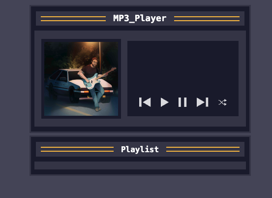

# **🎵 MP3 Player – Simple Web Music Player**

This project is a basic and interactive MP3 player built with **HTML, CSS, and JavaScript**. It demonstrates how to use the Web Audio **API, arrays, objects,** and **event handling** to create a dynamic music experience.It offers core features such as:

▶️ Play and pause music

⏭️ Skip to the next or previous track

🔀 Shuffle playback

📃 Dynamic playlist

🎧 Display of the currently playing instrument (optionally with image)

##The focus is on the practical use of modern JavaScript techniques to manage audio playback and playlist interaction directly in the browser.##

## 🖼️ Preview
Here’s what the drum kit looks like in action:

